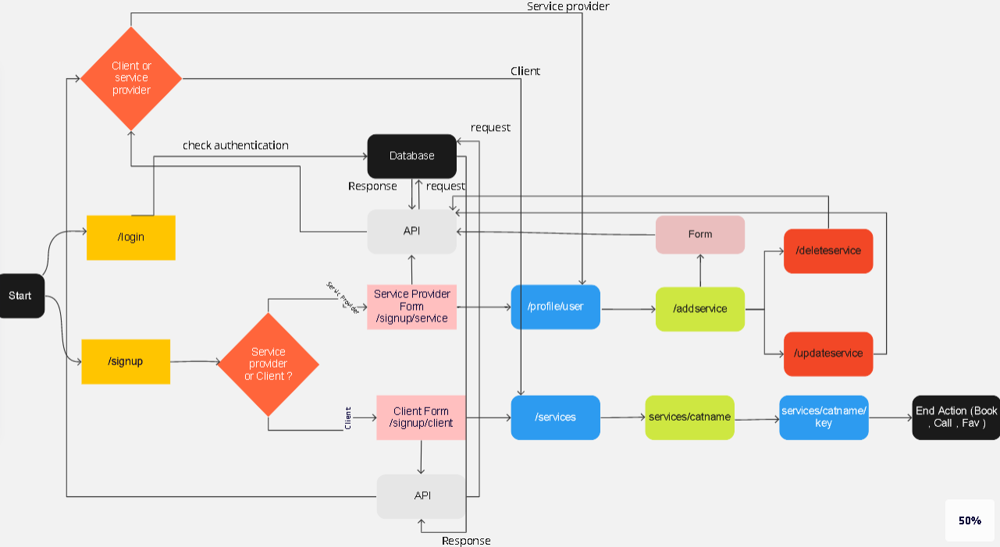
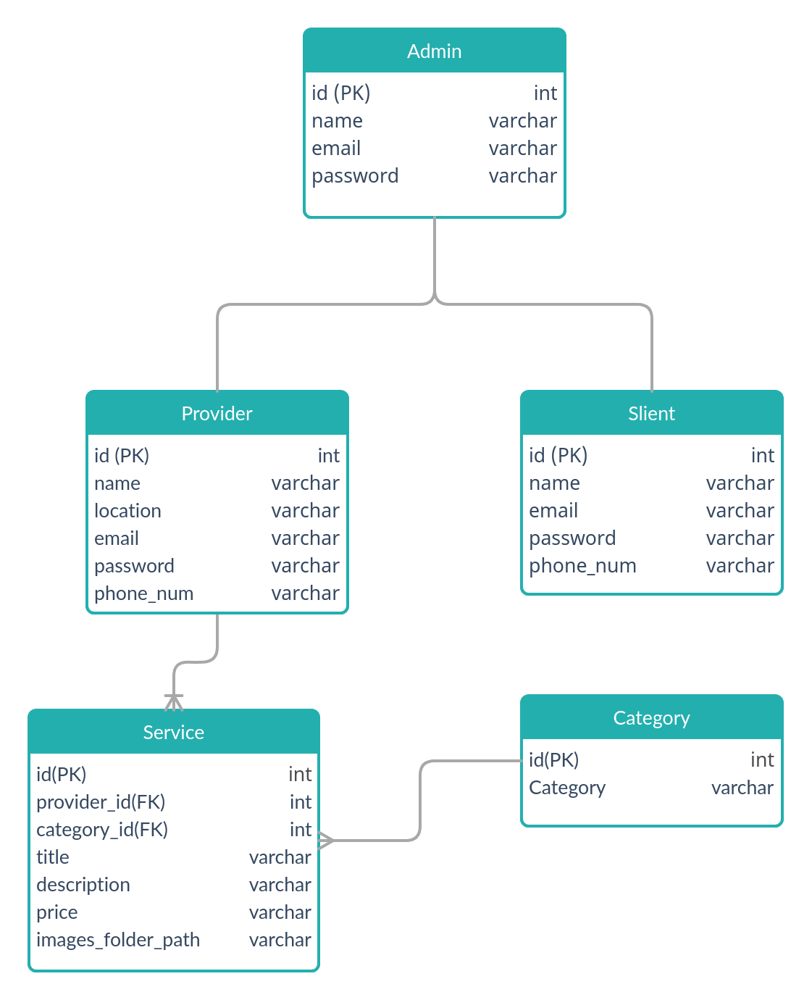

# Project name: Weddinger
___
# Team name: PyPandas

## Team members:
### [Abed alaziz alsalahat](https://github.com/abdalazzezzalsalahat)
### [Faisal abuzaid](https://github.com/faisalabuzaid)
### [Muhannad almughrabi](https://github.com/mhn998)
### [Noor Omari](https://github.com/nooromari)
### [Tala Hajeer](https://github.com/talahajeer)
____

  

___

 

# Synopsis: 

<h3>A wedding arrangement website that allows the user to book any wedding hall for their event(wedding, party, etc...) and choose ant setup as they wish. choosing photographer, wedding hall accessories (flowers, sheets, lights, etc...), Cake, etc...</h3>
 

## Mission:

<h3>To make wedding planning easier, and to make 
this more modern and automated.</h3>

 

# Wireframe 

[Link to Wireframe](https://www.figma.com/file/4ERBnikLrXsMIHMzdNBXFw/Weddinger)

# Project management tool
[Trello link](https://trello.com/b/XWf12hoC)

# Domain model

## Entity Relation Diagram (Database schema Diagram)

